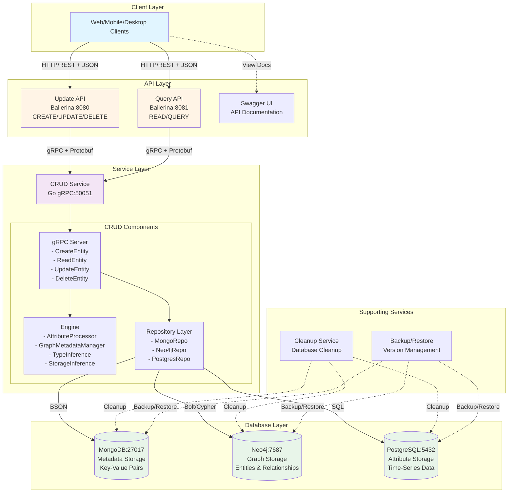
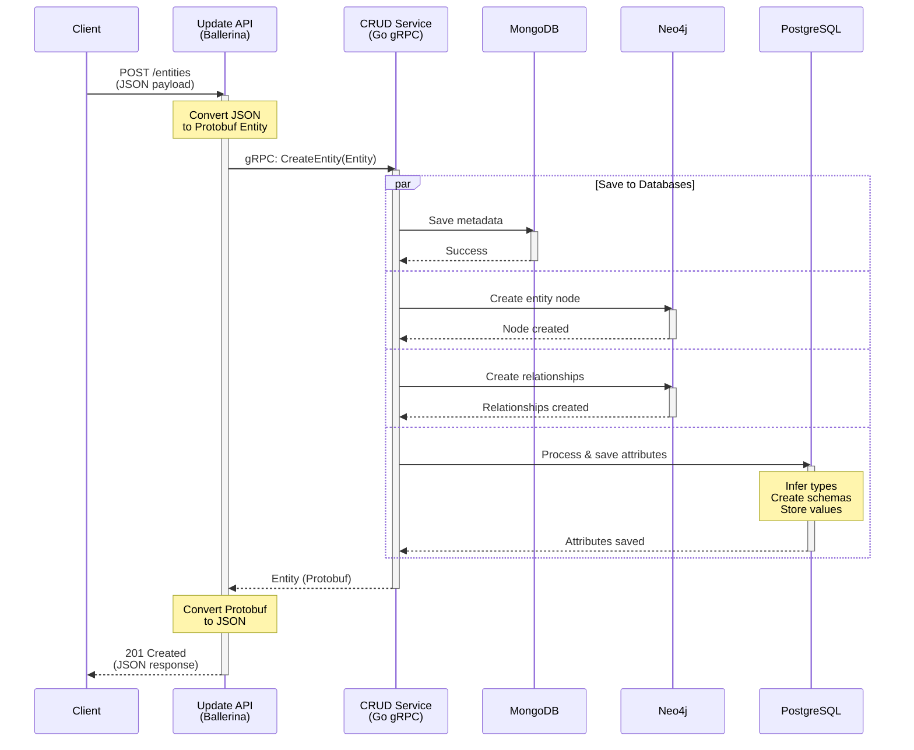
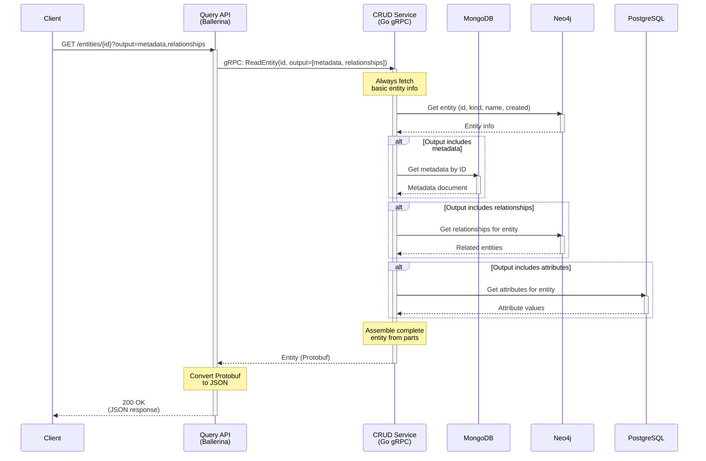
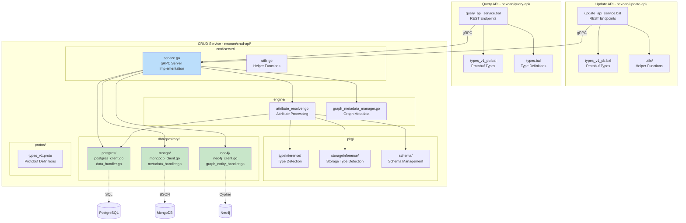
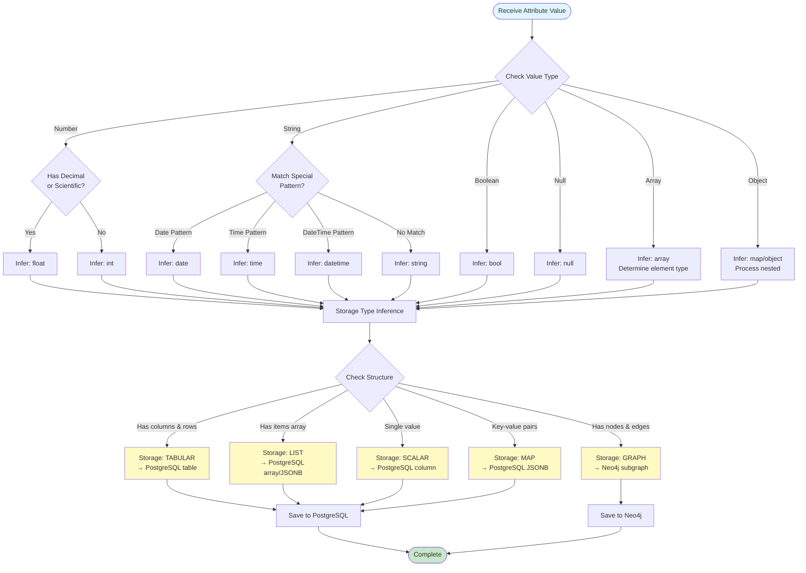
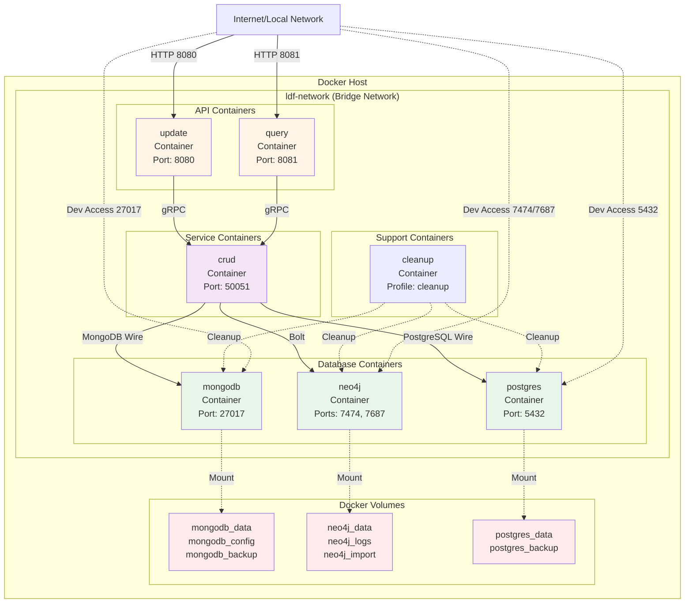
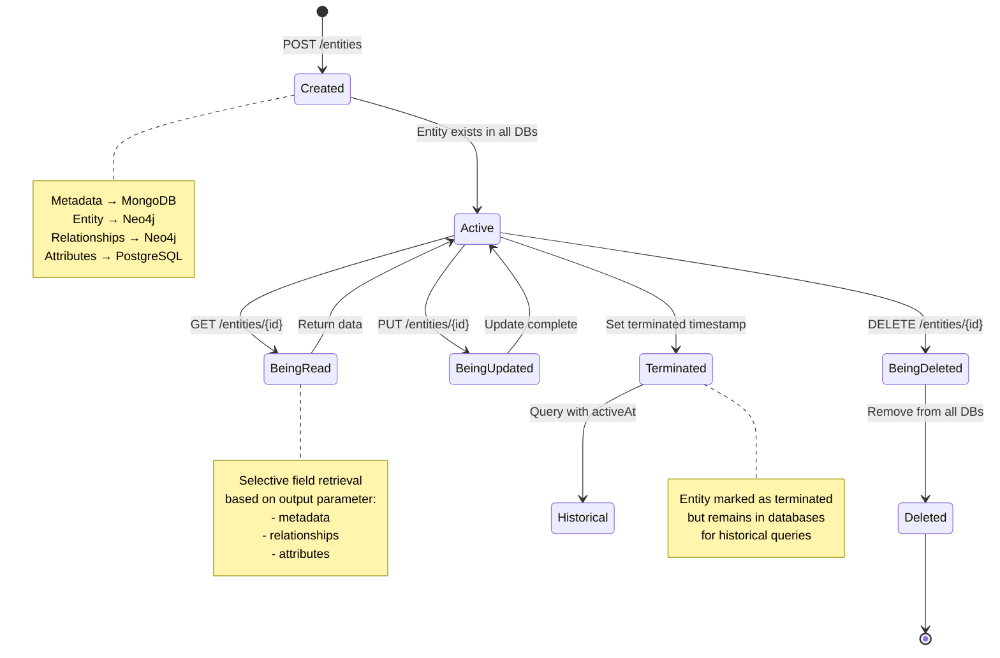
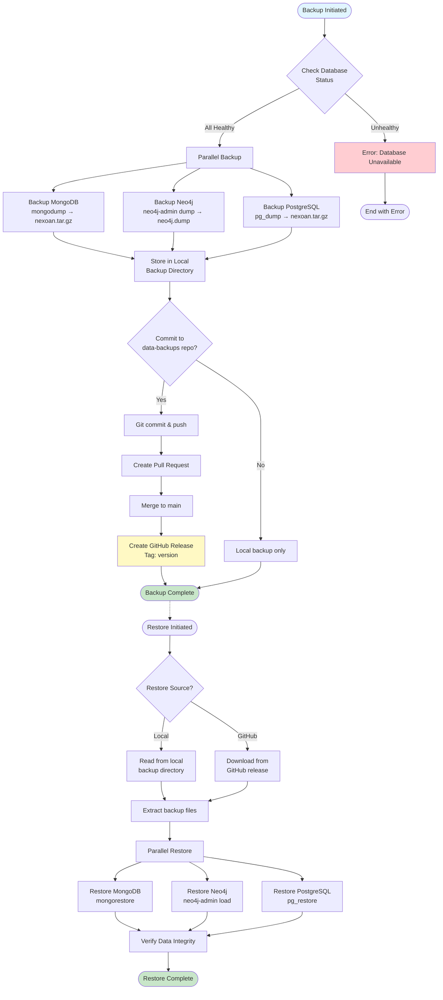

# Nexoan Architecture Diagrams

This document contains various architectural diagrams in Mermaid format for the Nexoan system.

---

## 1. System Architecture - High Level



---

## 2. Create Entity Data Flow



---

## 3. Read Entity Data Flow



---

## 4. Component Architecture



---

## 5. Data Storage Distribution

```mermaid
graph LR
    subgraph "Entity Data"
        Entity[Entity<br/>id: entity123<br/>kind: Person/Employee<br/>name: John Doe<br/>metadata: dept=Eng<br/>attributes: salary=100k<br/>relationships: reports_to]
    end
    
    subgraph "MongoDB"
        MetaDoc[metadata Collection<br/>{<br/>  _id: entity123,<br/>  metadata: {<br/>    department: Engineering,<br/>    role: Engineer<br/>  }<br/>}]
    end
    
    subgraph "Neo4j"
        EntityNode[entity123:Entity Node<br/>{<br/>  id: entity123,<br/>  kind_major: Person,<br/>  kind_minor: Employee,<br/>  name: John Doe,<br/>  created: 2024-01-01<br/>}]
        
        RelEdge[REPORTS_TO Relationship<br/>{<br/>  id: rel123,<br/>  startTime: 2024-01-01<br/>}]
        
        ManagerNode[manager123:Entity]
        
        EntityNode -->|RelEdge| ManagerNode
    end
    
    subgraph "PostgreSQL"
        AttrSchemas[attribute_schemas<br/>{<br/>  kind_major: Person,<br/>  attr_name: salary,<br/>  data_type: int,<br/>  storage_type: scalar<br/>}]
        
        EntityAttrs[entity_attributes<br/>{<br/>  entity_id: entity123,<br/>  attr_name: salary<br/>}]
        
        AttrTable[attr_Person_salary<br/>{<br/>  entity_id: entity123,<br/>  start_time: 2024-01,<br/>  end_time: NULL,<br/>  value: 100000<br/>}]
        
        AttrSchemas -.-> EntityAttrs
        EntityAttrs -.-> AttrTable
    end
    
    Entity -->|Metadata| MetaDoc
    Entity -->|Entity & Relationships| EntityNode
    Entity -->|Attributes| AttrSchemas
    
    style Entity fill:#fff9c4
    style MetaDoc fill:#c8e6c9
    style EntityNode fill:#bbdefb
    style RelEdge fill:#bbdefb
    style AttrSchemas fill:#f8bbd0
```

---

## 6. Type Inference Flow



---

## 7. Deployment Architecture



---

## 8. Entity Lifecycle State Machine



---

## 9. Backup and Restore Workflow



---

## 10. Attribute Processing Pipeline

```mermaid
flowchart LR
    subgraph "Input"
        AttrInput[Attribute Data<br/>{<br/>  name: salary,<br/>  value: 100000,<br/>  startTime: 2024-01<br/>}]
    end
    
    subgraph "Type Inference"
        TypeCheck[Infer Data Type<br/>→ int]
    end
    
    subgraph "Storage Inference"
        StorageCheck[Infer Storage Type<br/>→ SCALAR]
    end
    
    subgraph "Schema Management"
        CheckSchema{Schema<br/>Exists?}
        CreateSchema[Create Schema<br/>in attribute_schemas]
        UseSchema[Use Existing Schema]
        
        CheckSchema -->|No| CreateSchema
        CheckSchema -->|Yes| UseSchema
    end
    
    subgraph "Table Management"
        CheckTable{Table<br/>Exists?}
        CreateTable[Create Table<br/>attr_Kind_AttrName]
        UseTable[Use Existing Table]
        
        CheckTable -->|No| CreateTable
        CheckTable -->|Yes| UseTable
    end
    
    subgraph "Data Insertion"
        InsertData[Insert Attribute Value<br/>with time range]
    end
    
    subgraph "Link Entity"
        LinkEntity[Link in<br/>entity_attributes table]
    end
    
    AttrInput --> TypeCheck
    TypeCheck --> StorageCheck
    StorageCheck --> CheckSchema
    
    CreateSchema --> CheckTable
    UseSchema --> CheckTable
    
    CreateTable --> InsertData
    UseTable --> InsertData
    
    InsertData --> LinkEntity
    
    LinkEntity --> Output[Attribute Stored]
    
    style AttrInput fill:#e1f5ff
    style TypeCheck fill:#fff9c4
    style StorageCheck fill:#fff9c4
    style CreateSchema fill:#ffecb3
    style CreateTable fill:#ffecb3
    style Output fill:#c8e6c9
```

---

## Diagram Usage

### Viewing Diagrams

These Mermaid diagrams can be viewed in:
1. **GitHub** - Native Mermaid rendering
2. **VS Code** - With Mermaid extension
3. **Mermaid Live Editor** - https://mermaid.live
4. **Documentation Sites** - Most support Mermaid rendering

### Exporting Diagrams

To export as PNG/SVG:
```bash
# Install Mermaid CLI
npm install -g @mermaid-js/mermaid-cli

# Export diagram
mmdc -i diagrams.md -o output.png
```

### Updating Diagrams

When updating the architecture:
1. Update the relevant Mermaid diagram in this file
2. Update the ASCII diagrams in `overview.md` if needed
3. Ensure consistency across all documentation
4. Commit changes with descriptive message

---

**Document Version**: 1.0  
**Last Updated**: October 2024  
**Format**: Mermaid Diagram Language

